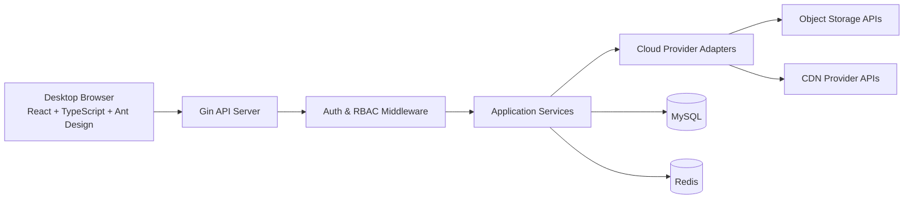
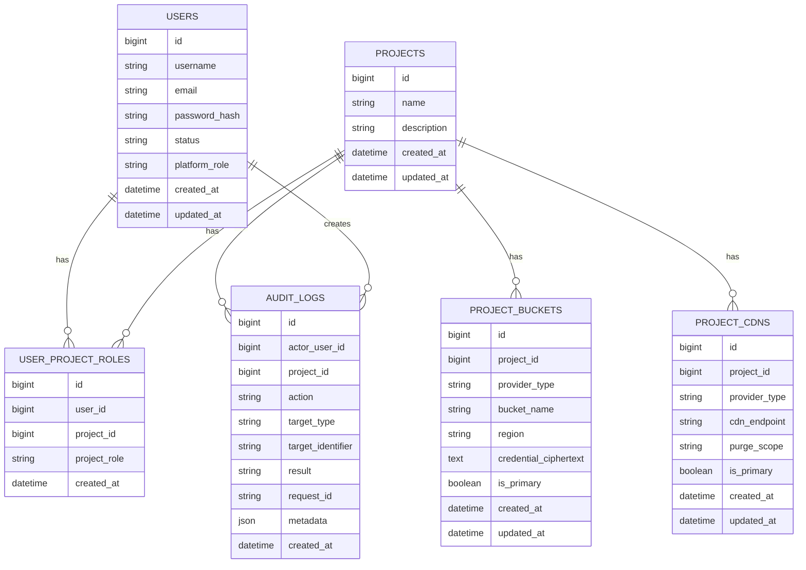

# Design Document

## Overview

CDN 管理平台采用前后端分离架构，目标是在单一平台内统一管理多云对象存储、项目级 CDN 配置、权限模型与审计追踪。系统面向电脑浏览器访问，前端使用 React + TypeScript + Ant Design，后端使用 Go + Gin + GORM，数据层使用 MySQL + Redis。

本设计优先满足以下目标：

- 通过统一抽象屏蔽云厂商对象存储与 CDN 刷新的差异。
- 通过项目作用域与 RBAC 组合校验防止越权访问。
- 通过审计日志确保所有关键写操作与外部云操作可追溯。
- 通过可扩展的 Provider 架构支持后续新增云厂商。
- 通过三套主题系统满足 Light、Auth、Dark 的桌面端体验要求。

### Key Design Decisions

1. 采用单体分层架构，而不是拆分微服务。
   - 理由：当前功能边界清晰但业务规模尚小，单体更利于快速迭代、统一权限校验与审计闭环。
2. 将对象存储与 CDN 能力抽象为 Provider 接口层。
   - 理由：四大云厂商在认证、路径、刷新 API 和错误模型上存在差异，抽象层可稳定上层业务逻辑。
3. 将审计写入作为服务层标准流程，而不是仅在控制器层记录。
   - 理由：服务层更接近业务动作边界，能覆盖 API、后台任务和后续 CLI/脚本调用。
4. 将 Redis 用于会话、权限缓存与短时任务状态，而不是存储核心业务真值。
   - 理由：核心配置、授权与审计必须可持久化、可审计、可回放，应以 MySQL 为准。

### Research Findings Incorporated

- Ant Design v5 支持通过 `ConfigProvider.theme` 动态切换 Design Token，适合实现平台级 Light、Auth、Dark 三主题切换。
- Gin 支持全局中间件、路由组中间件与嵌套路由组，适合按“认证 -> RBAC -> 项目作用域 -> 审计”顺序组织请求管线。
- Gin 的错误处理中间件模式适合统一输出结构化 JSON 错误响应。
- GORM 支持关联、`Preload` 与事务，适合项目授权关系、项目配置关系与关键写操作的一致性处理。
- Redis 官方 Go 客户端为 `go-redis`，适合承接缓存与会话能力。

## Architecture

### High-Level Architecture



### Backend Layering

后端按以下层级组织：

1. `handler` 层
   - 负责 HTTP 参数绑定、响应编码、调用应用服务。
2. `middleware` 层
   - 负责认证、角色校验、项目作用域校验、错误转换、请求追踪、审计上下文注入。
3. `service` 层
   - 负责业务规则、事务边界、跨仓储协调、审计记录触发、Provider 调用编排。
4. `repository` 层
   - 负责 GORM 查询与持久化。
5. `provider` 层
   - 负责封装各云厂商对象存储与 CDN 刷新能力。
6. `infra` 层
   - 负责数据库、Redis、加密、日志、配置加载等基础设施。

### Frontend Architecture

前端采用 React 单页应用，按领域拆分模块：

- `auth`
  - 登录、首次初始化提示、修改密码。
- `projects`
  - 项目列表、项目详情、项目配置编辑。
- `storage`
  - 存储桶文件列表、上传、下载、删除、重命名、审计查询入口。
- `cdn`
  - CDN 地址管理、目录刷新、URL 刷新、资源同步。
- `users`
  - 用户管理、项目角色绑定。
- `audit`
  - 平台审计查询、项目范围审计查询。
- `layout`
  - 导航、面包屑、主题切换、权限感知菜单。

### Theme Strategy

前端基于 Ant Design v5 的 Token 体系实现三套主题：

- `Light`
  - 默认工作台主题，强调清晰信息密度。
- `Auth`
  - 登录与初始化页面专用主题，强化品牌与身份验证氛围。
- `Dark`
  - 暗色工作台主题，用于低亮度环境。

赛博科技风格通过以下方式控制，不影响可读性：

- 以蓝青色系作为强调色，而不是大面积高饱和背景。
- 在登录页、初始化页与空状态页加入轻量渐变和网格纹理。
- 在业务表格页保持高对比与高信息密度，避免过度装饰。

## Components and Interfaces

### Backend Core Components

#### 1. Authentication Component

职责：

- 用户登录
- 密码校验与密码修改
- 首次启动超级管理员初始化
- 会话或令牌签发与校验

主要接口：

- `POST /api/v1/auth/login`
- `POST /api/v1/auth/change-password`
- `GET /api/v1/auth/me`

#### 2. User and RBAC Component

职责：

- 用户创建、编辑、禁用、删除
- 平台管理员重置用户密码
- 项目角色绑定
- 平台管理员与项目角色校验

主要接口：

- `GET /api/v1/users`
- `POST /api/v1/users`
- `PUT /api/v1/users/:id`
- `DELETE /api/v1/users/:id`
- `PUT /api/v1/users/:id/password`
- `PUT /api/v1/users/:id/project-bindings`

RBAC 规则：

- 平台管理员：全平台资源可管理。
- 项目管理员：仅可管理已授权项目的资源、CDN、审计查询。
- 项目只读用户：仅可查看已授权项目的配置、资源与日志。

#### 3. Project Management Component

职责：

- 项目创建、编辑、删除
- 项目绑定云厂商、存储桶、CDN 地址
- 项目隔离校验

主要接口：

- `GET /api/v1/projects`
- `POST /api/v1/projects`
- `GET /api/v1/projects/:id`
- `PUT /api/v1/projects/:id`
- `DELETE /api/v1/projects/:id`

#### 4. Storage Component

职责：

- 存储桶连接校验
- 文件列表查询
- 上传、下载、删除、重命名
- 自动识别云厂商

主要接口：

- `POST /api/v1/storage/connections/validate`
- `GET /api/v1/projects/:id/storage/objects`
- `POST /api/v1/projects/:id/storage/upload`
- `GET /api/v1/projects/:id/storage/download`
- `DELETE /api/v1/projects/:id/storage/objects`
- `PUT /api/v1/projects/:id/storage/rename`

Provider 抽象建议：

```go
type ObjectStorageProvider interface {
    Detect(ctx context.Context, credential CredentialPayload, bucket string) (ProviderType, error)
    ListObjects(ctx context.Context, req ListObjectsRequest) ([]ObjectInfo, error)
    UploadObject(ctx context.Context, req UploadObjectRequest) error
    DownloadObject(ctx context.Context, req DownloadObjectRequest) (io.ReadCloser, ObjectMeta, error)
    DeleteObject(ctx context.Context, req DeleteObjectRequest) error
    RenameObject(ctx context.Context, req RenameObjectRequest) error
}
```

#### 5. CDN Component

职责：

- 项目 CDN 地址配置管理
- URL 刷新与目录刷新
- 资源同步编排

主要接口：

- `POST /api/v1/projects/:id/cdn/refresh-url`
- `POST /api/v1/projects/:id/cdn/refresh-directory`
- `POST /api/v1/projects/:id/cdn/sync`

Provider 抽象建议：

```go
type CDNProvider interface {
    RefreshURLs(ctx context.Context, req RefreshURLsRequest) (ProviderTaskResult, error)
    RefreshDirectories(ctx context.Context, req RefreshDirectoriesRequest) (ProviderTaskResult, error)
    SyncLatestResources(ctx context.Context, req SyncResourcesRequest) (ProviderTaskResult, error)
}
```

说明：

- “资源同步” 在平台层定义为业务流程，而不是依赖所有厂商提供同名原生 API。
- 平台先确定同步目标对象，再触发相应 CDN 刷新，以达成“同步最新资源到 CDN，自动更新缓存”的业务效果。

#### 6. Audit Component

职责：

- 记录关键业务操作
- 支持按项目、用户、操作类型、时间范围筛选
- 按角色限制可见范围

主要接口：

- `GET /api/v1/audits`
- `GET /api/v1/projects/:id/audits`

审计写入范围：

- 登录成功与失败
- 用户管理操作
- 管理员重置用户密码操作
- 项目管理操作
- 存储桶文件操作
- CDN 刷新操作
- 资源同步操作
- 越权访问拦截
- 敏感配置变更

### Middleware Pipeline

建议中间件顺序如下：

1. `RequestIDMiddleware`
2. `StructuredLoggerMiddleware`
3. `RecoveryMiddleware`
4. `AuthMiddleware`
5. `RBACMiddleware`
6. `ProjectScopeMiddleware`
7. `AuditContextMiddleware`
8. `ErrorHandlerMiddleware`

设计说明：

- `RBACMiddleware` 负责用户是否具备某类动作权限。
- `ProjectScopeMiddleware` 负责目标项目是否在用户授权范围内。
- 两者拆分后，权限模型更清晰，日志也能区分“角色不足”与“项目越权”。

### Async and Caching Strategy

Redis 用途限定为：

- 登录态或会话缓存
- 用户项目权限快照缓存
- 短时任务状态缓存，例如 CDN 刷新请求状态
- 短时列表缓存，例如项目主页统计信息

不进入 Redis 的数据：

- 用户真值信息
- 项目真值配置
- 存储桶凭证真值
- 审计日志真值

资源同步与刷新可采用“请求立即返回任务受理结果 + 前端轮询状态”的方式，避免长请求阻塞。

## Data Models

### Entity Model



### Model Details

#### `users`

- `platform_role`
  - 枚举：`super_admin`、`platform_admin`、`standard_user`
- `status`
  - 枚举：`active`、`disabled`
- `password_hash`
  - 使用密码摘要算法存储，不保存明文密码

#### `projects`

- 保存项目名称、描述、创建时间
- 不直接内嵌云配置，避免项目主表膨胀

#### `user_project_roles`

- 表达“一个用户可拥有多个项目角色”的多对多关系
- 建议唯一约束：`(user_id, project_id)`

#### `project_buckets`

- 每项目允许 1 至 2 条有效绑定
- `credential_ciphertext` 存储加密后的敏感凭据
- `provider_type` 用于落库记录识别后的厂商类型

#### `project_cdns`

- 每项目允许 1 至 2 条有效绑定
- 保留 `provider_type`，便于后续支持厂商差异化刷新参数

#### `audit_logs`

- `action`
  - 例如：`object.upload`、`object.delete`、`cdn.refresh_url`、`user.disable`
- `result`
  - 枚举：`success`、`failure`、`denied`
- `metadata`
  - 保存请求摘要、错误码、对象路径、刷新路径、IP、User-Agent 等补充信息

### Security and Secret Management

敏感数据处理：

- 用户密码使用密码摘要存储。
- AccessKey 与关联敏感凭据使用应用级加密后落库。
- 后端通过配置注入主加密密钥，不写入源码仓库。
- API 响应默认脱敏，前端不回显完整凭据。

权限控制：

- 控制器层不直接信任前端传入的项目 ID。
- 所有项目级查询与写操作均经过项目作用域校验。
- 删除、重命名、刷新、同步均要求写权限。
- 查看列表、下载、审计查询按角色细分只读与管理权限。

### Initialization Strategy

系统启动时执行初始化检查：

1. 检查 `users` 表是否为空。
2. 若为空，则创建超级管理员账号。
3. 生成初始登录标识与一次性初始密码或从环境变量读取初始化密码。
4. 记录初始化审计日志。

推断说明：
基于你的运维背景和安全要求，首版设计倾向于“环境变量提供初始密码或一次性密码”，这样比硬编码默认密码更安全。

## Error Handling

### Error Categories

- `AUTHENTICATION_FAILED`
  - 登录失败、会话失效、身份凭证缺失
- `AUTHORIZATION_DENIED`
  - 角色不足
- `PROJECT_SCOPE_DENIED`
  - 访问未授权项目
- `VALIDATION_ERROR`
  - 请求参数不合法
- `PASSWORD_POLICY_VIOLATION`
  - 新密码不满足密码策略要求
- `PROVIDER_CONNECTION_FAILED`
  - 存储桶连接校验失败
- `PROVIDER_OPERATION_FAILED`
  - 对象存储或 CDN 厂商操作失败
- `RESOURCE_NOT_FOUND`
  - 项目、用户、对象、绑定配置不存在
- `CONFLICT_ERROR`
  - 用户、项目、绑定关系冲突
- `INTERNAL_ERROR`
  - 未分类内部错误

### Error Response Format

统一 JSON 错误结构：

```json
{
  "code": "AUTHORIZATION_DENIED",
  "message": "project write permission required",
  "requestId": "req_123456",
  "details": {}
}
```

### Error Handling Rules

- 外部厂商错误在 `provider` 层转换为统一领域错误。
- `handler` 层不直接透传厂商原始错误正文，避免泄露敏感信息。
- 所有失败写操作必须记录审计日志。
- 越权与认证失败要分别记录，便于审计分析。
- 文件上传与同步失败时，响应中返回可追踪请求编号。

## Testing Strategy

### Backend Testing

重点测试以下核心逻辑：

- RBAC 判定与项目作用域校验
- 管理员重置用户密码权限与密码策略校验
- 项目绑定数量约束
- 首次启动超级管理员初始化逻辑
- Provider 抽象层的参数组装与错误映射
- 审计日志写入触发条件
- 存储桶文件操作服务逻辑
- CDN 刷新与资源同步编排逻辑

测试层次：

- Repository 测试
  - 验证 GORM 模型、约束与查询行为
- Service 测试
  - 验证事务、权限、审计与业务编排
- Handler 测试
  - 验证请求校验、状态码与响应结构

### Frontend Testing

重点测试以下核心逻辑：

- 登录态与路由守卫
- 基于权限的菜单与按钮可见性
- 项目切换后的数据隔离
- 上传、删除、重命名、刷新等关键交互流程
- 三套主题切换是否正确应用

### Integration Boundaries

对于云厂商集成测试，建议采用分层策略：

- 单元测试中仅验证 Provider 适配器的参数转换与错误映射
- 集成测试中验证与测试环境云资源的真实交互
- 审计与权限逻辑优先在本地自动化测试覆盖

### Non-Goals for Initial Version

首版设计暂不包含以下能力：

- 移动端适配
- 自动化成本统计
- 跨项目资源复制
- 多租户企业组织层级
- 大规模异步工作流编排系统

## Traceability to Requirements

- Requirement 1: 由 Storage Component、ObjectStorageProvider、`project_buckets` 模型覆盖
- Requirement 2: 由 CDN Component、CDNProvider、异步任务状态设计覆盖
- Requirement 3: 由 Project Management Component、项目作用域中间件与项目绑定模型覆盖
- Requirement 4: 由 Authentication Component、User and RBAC Component、`user_project_roles` 模型覆盖
- Requirement 5: 由 Initialization Strategy 覆盖
- Requirement 6: 由 Audit Component、审计写入范围与可见范围控制覆盖
- Requirement 7: 由 Frontend Architecture 与 Theme Strategy 覆盖
- Requirement 8: 由 Security and Secret Management、RBAC 与错误处理规则覆盖
- Requirement 9: 由分层架构、Provider 抽象、Redis 策略与数据模型拆分覆盖
- Requirement 10: 由 User and RBAC Component 的管理员重置密码接口、审计写入与前端用户管理页面交互覆盖
